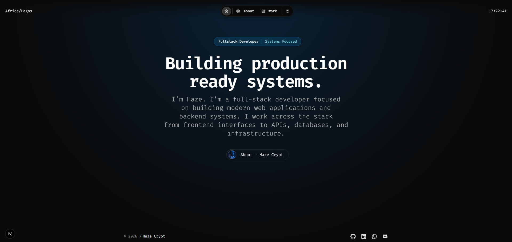

# Haze Crypt - Portfolio

I’m Haze. I’m a full-stack developer focused on building modern web applications and backend systems. I work across the stack
from frontend interfaces to APIs, databases, and infrastructure.

    

## Tech Stack
- Next.js
- TypeScript
- Express
- Javascript
- Node.js
- React.js
- MongoDB
- PostgreSQL

## Contact
- [LinkedIn](https://www.linkedin.com/in/ismail-yakubu-5a6304311)
- [GitHub](https://github.com/loneprog)
- [Email](mailto:sigmawolf150@gmail.com)

## License
GPL 3.0